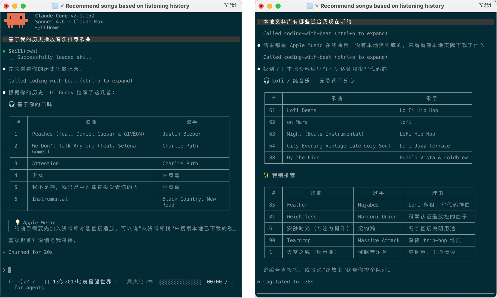
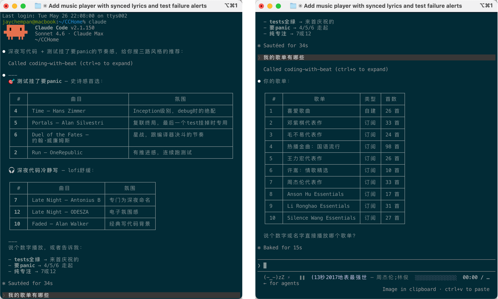
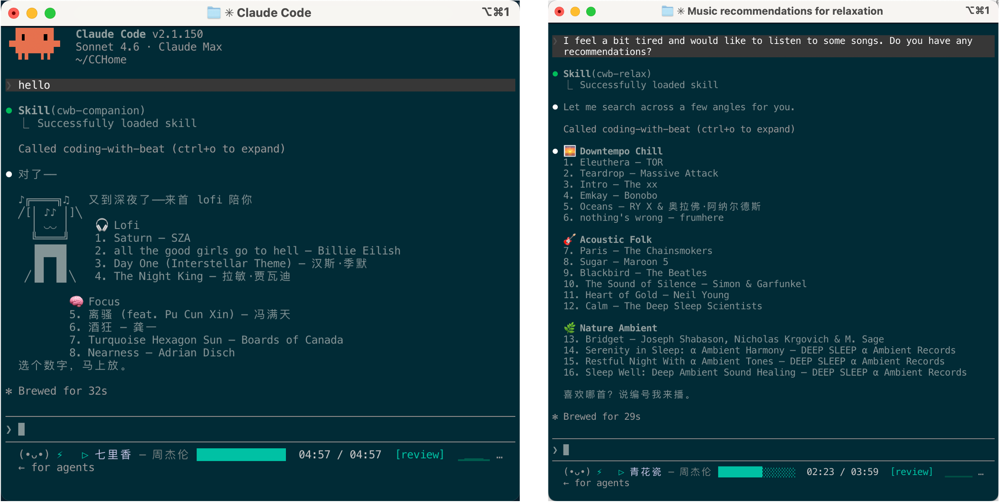

<div align="center">
  
  <h1>Coding with Beat</h1>
  <p>将音乐搬进AI终端 · 打造Coding专属智能DJ · 听歌新范式 · 交互式音乐</p>
</div>


[](https://codebeat.top)
[](#)

> [!NOTE]
> Want to try the latest features before release? Check out the **[dev branch](https://github.com/jaychempan/coding-with-beat/blob/dev/README.md)** for cutting-edge updates.

> **When was the last time you sang and danced while vibecoding?**（上次 vibecoding 时又唱又跳是什么时候？）
>
> Right. You can't remember.（对，你已经不记得了。）


**Your coding soundtrack, now inside the terminal.** Smart music selection, mood-aware playback, and a pixel DJ that vibes with every keystroke — works with Claude Code, Codex CLI, and any AI-powered terminal.

A retro pixel DJ companion for AI coding sessions. It plays music, shows lyrics, celebrates when you commit, and panics with you when tests fail.

[中文文档](README_CN.md) ／ [日本語](README_JP.md)

<video src="https://github.com/user-attachments/assets/c51dcac1-115e-4d30-b87f-b1e7043d1347" controls autoplay loop muted width="100%"></video>



<details>
<summary>More screenshots</summary>





</details>

> 💬 **We'd love your feedback!**
> Using Coding with Beat? Tell us what you think — features you want, bugs you've hit, or just how it's changed your coding sessions.
> **[→ Take the 7-min survey](https://codebeat.top/survey/)** (EN / 中文 both supported)

---

## 🆕 What's New

**`/cwb-profile` — Music Profile & Listening Reports** _(dev preview)_

A new skill that analyses your play history and search patterns to generate personalised listening reports and recommendations — daily, weekly, monthly, or yearly.

**Try it** — just say it naturally:

```
帮我生成本周的听歌报告
生成年度音乐画像
我最近都在听什么？适合写代码的
what have I been listening to this week
```

The AI calls `generate_profile()` and returns:

- 📊 Top artists · genres · language breakdown
- 📈 Rising / stable / declining tastes
- 🕐 Time-of-day listening patterns
- 🎵 2–3 personalised `smart_search` queries ready to play

**CLI** (works offline, no MCP server needed):

```bash
cwb profile           # weekly (default)
cwb profile daily
cwb profile monthly
cwb profile yearly
```

---

## Features

- **MCP server** — 38 tools so you can tell your AI "play some lofi", "skip this", "what's playing" and it just works.
- **`/cwb` skill** — Auto-registered routing brain: mood/vibe → multi-angle smart search, specific song/artist → catalog lookup, "play 3" → `play_number`. The AI always calls the right tool.

  | Scene | Say… |
  |-------|------|
  | 🎧 Lofi | lofi · 深夜写代码 · chillhop |
  | 🧠 Focus | 专注 · ambient · flow state |
  | 🔥 Hype | workout · 充能 · 运动 |
  | ☕ Jazz | jazz · 咖啡馆 · bossa nova |
  | 🌆 Synthwave | synthwave · 赛博 · 夜驾 |
  | 🌅 Relax | 放松 · unwind · 下班 |
  | 🎹 Classical | 古典 · 钢琴 · classical |
  | 💙 Sad | 伤感 · heartbreak · 难过 |
  | 🎉 Party | party · edm · 蹦迪 |
  | 🏮 Chinese | 国风 · 华语 · 古风 |
  | 🌙 Sleep | 助眠 · sleep · 白噪音 |
- **Playlists** — List and play your Apple Music playlists (user-created + subscription) directly from the AI: "我有哪些歌单" → numbered list → "播放周杰伦代表作". Queue syncs to `cwb watch` automatically.
- **Play history** — `cwb history` / `list_history` shows your recently played tracks sourced from Apple Music's native played date. `history_search` recommends new music based on your listening patterns.
- **Music sources** — Apple Music (AppleScript, no GUI needed), local files (afplay), QQ Music (search + preview).
- **Pixel UI** — Album art in half-block ANSI, GameBoy retro border, pseudo-spectrum equalizer.
- **DJ Buddy** — A headphones-wearing pixel character that reacts to your coding state. Tests failing? It panics with you.
- **Vibe engine** — CC hooks track what you're doing in real time and shift the mood. `git commit`? Victory pose. Tests explode? Panic mode.
- **Statusline** — One line: face + current track + progress bar.
- **Focus mode** — Built-in 25/5 Pomodoro timer shown in the statusline.

---

## Installation

### Claude Code

```bash
curl -LsSf https://raw.githubusercontent.com/jaychempan/coding-with-beat/main/bootstrap.sh | sh
```

Or manually:

```bash
git clone https://github.com/jaychempan/coding-with-beat.git
cd coding-with-beat
./install.sh
```

The installer configures Claude Code to use the HTTP MCP endpoint at `http://127.0.0.1:8765/mcp`, saves that URL to `~/.coding-with-beat/mcp-url`, and on macOS starts a user LaunchAgent for the local MCP server.

Open a new shell and a new Claude Code session. When `(•_•)` appears in the statusline, you're good.

### Codex CLI

```bash
curl -LsSf https://raw.githubusercontent.com/jaychempan/coding-with-beat/main/bootstrap_codex.sh | sh
```

Or manually:

```bash
git clone https://github.com/jaychempan/coding-with-beat.git
cd coding-with-beat
./install_codex.sh
```

Installs Codex CLI if needed, configures `~/.codex/config.toml` with the MCP endpoint, writes hooks, and installs the `cwb` skill so Codex recognises music commands automatically. Proxy is auto-detected. Re-running is safe — already-completed steps are skipped automatically.

See **[README_CODEX.md](README_CODEX.md)** for the full integration guide — hooks, proxy, mood reactions, statusline alternatives, and debugging.

### Dev Preview

> **Dev preview install:**
> ```bash
> # Claude Code
> CWB_BRANCH=dev curl -LsSf https://raw.githubusercontent.com/jaychempan/coding-with-beat/dev/bootstrap.sh | sh
>
> # Codex CLI
> CWB_BRANCH=dev curl -LsSf https://raw.githubusercontent.com/jaychempan/coding-with-beat/dev/bootstrap_codex.sh | sh
> ```

---

## Usage

> [!TIP]
> **Not sure what to say?** Just ask — `DJ 能做什么` / `DJ help` — and DJ Buddy will show you a full list of phrases you can use.
>
> **Live player:** Open a second terminal and run `cwb watch` to see the currently playing track, lyrics, and progress bar in real time.
>
> **Apple Music:** The first time you play a catalog track, a popup will appear — click **Add to Library**, then repeat the play command.

### Just talk to your AI assistant

```
play some lofi
skip this track
what's playing
pause
recommend something based on my history  # history_search — analyzes your patterns, suggests new tracks
show my recently played tracks           # list_history — reads Apple Music's native play log
基于我的历史推荐一些歌曲                    # same, in Chinese
```

`history_search` looks at your top artists, listening style, and tracks you haven't heard in a while, then runs a smart multi-angle search. Pick a number to play.

### `/cwb` command

```
/cwb play "lofi beats"    # search and play
/cwb play lofi beats
/cwb search "lofi beats"  # search library + Apple Music, show numbered list
/cwb play 2               # play track #2 from last search / list results
/cwb list                 # list all library tracks
/cwb loved                # list loved/hearted tracks
/cwb playlists            # list all playlists (user + subscription)
/cwb play_playlist <name> # play a playlist by name
/cwb history [n]          # recently played tracks
/cwb next
/cwb pause
/cwb np                   # now playing
/cwb like
/cwb volume 70
/cwb watch                # live player (q to quit)
/cwb karaoke              # full-screen karaoke (q to quit)
/cwb lyrics               # lyrics window
/cwb bar auto             # statusline: auto / show / hide
```

Natural-language commands work too: `skip this track`, `pause`, `what's playing`, and `like this` are all valid.

### `watch` / `karaoke` shortcuts

| Key | Action |
|-----|--------|
| `Space` | Play / pause |
| `n` | Next |
| `p` | Previous |
| `l` | Like |
| `0-9` | Type a track number + `Enter` to jump to it |
| `q` | Quit |

---

## Statusline

Once installed, a statusline appears at the bottom of Claude Code:

```
(•_•) ⚡  ▶ Midnight City — M83  ██████░░░░░░░░  [build]  ▃▆█▆▃  │ ♪ lyric preview
```

| Element | Example | Description |
|---------|---------|-------------|
| DJ face | `(•_•)` `(^_^)` `(T_T)` | Buddy's mood, shifts with coding events |
| Activity | `⚡` / `·` / _(none)_ | `⚡` = tool call in last 15 s; `·` = last 90 s |
| Play icon | `▶` / `▷` / `❚❚` | Blinks while playing; ❚❚ when paused |
| Track | `Midnight City — M83  ██████░░░░░░░░` | Title + artist + progress bar |
| Vibe | `[build]` `[focus]` etc. | Current coding vibe |
| Pomodoro | `🍅 work 24:15` | Only shown when focus mode is active |
| Beat wave | `▁▂▃▄▅` | Rises and falls each beat; dims when paused |
| Lyrics | `│ ♪ lyrics here` | Current LRC lyric |

<details>
<summary>Little easter egg: show it anywhere</summary>

`cwb statusline` is the same renderer Claude Code uses. It reads optional JSON from stdin, uses `columns` as a width hint, and prints one compact status bar line to stdout.

```bash
printf '{"columns":120}' | cwb statusline
```

That makes it easy to plug into other status bars. For example, tmux can show CWB on the right side of its status bar:

#### tmux status-right

```tmux
set -g status-right-length 180
set -g status-interval 1
set -g status-right '#(printf "{\"columns\":170}" | cwb statusline | perl -pe "s/\e\[[0-9;]*m//g")'
```

`cwb statusline` currently emits ANSI-coloured terminal text. The `perl` bit strips ANSI escape codes because tmux status formats use their own styling syntax. Increase or decrease `columns` and `status-right-length` to control how much room lyrics get.

#### Neovim statusline

Neovim can also show CWB in its statusline. Keep the shell call asynchronous so editing never waits on music state:

```lua
local cwb = { text = "", running = false }

local function strip_ansi(text)
  return text:gsub("\27%[[0-9;]*m", "")
end

local function refresh()
  if cwb.running or vim.fn.executable("cwb") == 0 then
    return
  end
  cwb.running = true
  vim.system({ "cwb", "statusline" }, {
    text = true,
    stdin = vim.json.encode({ columns = 90 }),
  }, function(result)
    vim.schedule(function()
      cwb.running = false
      if result.code == 0 and result.stdout then
        cwb.text = vim.trim(strip_ansi(result.stdout)):gsub("%%", "%%%%")
        vim.cmd.redrawstatus()
      end
    end)
  end)
end

_G.cwb = cwb
vim.fn.timer_start(1000, refresh, { ["repeat"] = -1 })
refresh()
vim.o.statusline = "%f %m%r %= %{v:lua.cwb.text}"
```

</details>

---

## SSH Remote (Claude Code / Codex CLI on a server)

If your AI CLI runs on a remote server while Apple Music runs on your local Mac, run the streamable HTTP MCP server on the Mac and reach it from the server through SSH reverse port forwarding:

```bash
# Local Mac: install and start the HTTP MCP LaunchAgent
./install.sh          # for Claude Code
./install_codex.sh    # for Codex CLI

# Local Mac: expose it to the server's 127.0.0.1:8765
ssh -N -R 127.0.0.1:8765:127.0.0.1:8765 user@server

# Server: install hooks/statusline and point them at the forwarded endpoint
./install.sh --mcp-url http://127.0.0.1:8765/mcp          # Claude Code
./install_codex.sh --mcp-url http://127.0.0.1:8765/mcp    # Codex CLI
```

The remote session, `/cwb`, statusline, hooks, and `cwb` CLI all use the same HTTP MCP URL. As long as the SSH tunnel is up, commands like `cwb play`, `cwb np`, `cwb next`, `cwb player`, and `cwb karaoke` control the Mac-side music client.

---

## CLI

```
cwb play [query]        # search and play, or resume
cwb play <n>            # play track #n from last search or list results
cwb search <query>      # search library + Apple Music catalog (numbered list)
cwb list [n]            # list all library tracks (default 100)
cwb loved [n]           # list loved/hearted tracks (default 50)
cwb playlists           # list all playlists (user + subscription)
cwb play_playlist <name> # play a playlist by name
cwb pause               # pause
cwb next                # next track
cwb prev                # previous track
cwb np                  # now playing
cwb like                # like current track
cwb volume <0-100>      # set volume
cwb seek <t>            # seek: seconds (90) or mm:ss (1:30)
cwb mode <mode>         # shuffle | sequential | repeat | repeat_one
cwb player              # full pixel player
cwb watch               # live TUI (q to quit)
cwb karaoke             # full-screen karaoke (q to quit)
cwb lyrics              # lyrics window
cwb history [n]         # last n played tracks
cwb bar <show|hide|auto> # statusline visibility
cwb statusline          # render one compact statusline frame
cwb status              # current state
cwb server              # MCP streamable HTTP server
```

---

## Music sources

| Feature | Apple Music | Local files | QQ Music |
|---------|-------------|-------------|----------|
| Now playing info | ✓ | ✓ | ⚠ preview only |
| Play / pause | ✓ | ✓ | ✓ |
| Next / prev | ✓ | ✓ | ✓ |
| Seek | ✓ | ⚠ restart-based | ⚠ preview only |
| Volume | ✓ | ✓ | ⚠ coarse steps |
| Like / favorite | ✓ | ✗ | ✓ |
| Cover art | ✓ | ✓ | ✓ |
| Full playback | ✓ subscription req. | ✓ | ✗ 30 s preview |
| Play modes | ✓ | ✗ | ✓ |
| Playlists | ✓ | ✗ | ✗ |
| Play history | ✓ native | ✓ log-based | ✓ log-based |

> QQ Music has no official API. Search metadata comes from public endpoints; audio is played as 30-second preview clips via afplay. Full tracks require the QQ Music desktop app.

---

## Uninstall

```bash
# Claude Code
./uninstall.sh           # remove config, commands, PATH
./uninstall.sh --purge   # same + delete ~/.coding-with-beat/

# Codex CLI
./uninstall_codex.sh           # remove Codex config, skill, LaunchAgent
./uninstall_codex.sh --purge   # same + delete ~/.coding-with-beat/
```

---

## Citation

If you use Coding with Beat in your research or project, please cite:

```bibtex
@misc{pan2025codingwithbeat,
  author       = {Jiancheng Pan et al.},
  title        = {Coding with Beat: Staying in Flow with Context-Aware Music in AI Coding Sessions},
  year         = {2026},
  howpublished = {\url{https://github.com/jaychempan/coding-with-beat}},
  note         = {Website: \url{https://codebeat.top}}
}
```

---

## Star History

<a href="https://www.star-history.com/?repos=jaychempan%2Fcoding-with-beat&type=date&legend=top-left">
 <picture>
   <source media="(prefers-color-scheme: dark)" srcset="https://api.star-history.com/chart?repos=jaychempan/coding-with-beat&type=date&theme=dark&legend=top-left" />
   <source media="(prefers-color-scheme: light)" srcset="https://api.star-history.com/chart?repos=jaychempan/coding-with-beat&type=date&legend=top-left" />
   
 </picture>
</a>

---

## License

MIT License — see [LICENSE](LICENSE) for details.
