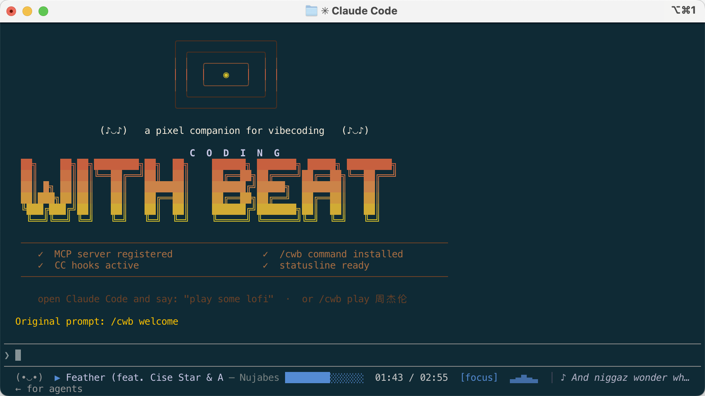

<div align="center">
  
  <h1>Coding with Beat</h1>
  <p>将音乐搬进AI终端 · 打造Coding专属智能DJ · 听歌新范式 · 交互式音乐</p>
</div>


[](https://codebeat.top)

> **バイブコーディング中に歌って踊ったのはいつだっけ？**
>
> そう、覚えていないよね。



**コーディングのサウンドトラックを、ターミナルの中へ。** 気分に合わせた選曲、コーディング状態を感知するスマート再生 — Claude Code & Codex CLI のための専属インテリジェント DJ プラットフォーム。

Claude Code / Codex CLI / ターミナル向けのレトロなピクセル DJ コンパニオン。音楽を流し、歌詞を表示し、コミット成功を祝い、テスト失敗には一緒にパニックになります。

[English README](README.md) ／ [中文文档](README_CN.md)

---

## 機能紹介

- **MCP サーバー** — 28 個のツールを AI アシスタントに公開。「lofi かけて」「次の曲に」「今何が流れてる？」と自然に話しかけるだけで動きます。
- **音楽ソース** — Apple Music（AppleScript、GUI 不要）、ローカルファイル（afplay）、QQ Music（検索＋プレビュー）。
- **ピクセル UI** — アルバムアートを半ブロック ANSI 文字でレンダリング。GameBoy レトロボーダー＆疑似スペクトラムイコライザー付き。
- **DJ Buddy** — ヘッドフォンをつけたピクセルキャラクター。コーディング状態に合わせて表情が変わります。テスト失敗？一緒にパニックに。
- **バイブエンジン** — CC フック（PreToolUse / PostToolUse / SessionStart / Stop）でリアルタイムに状況を把握し、雰囲気を自動調整。`git commit` したら勝利ポーズ。テストが爆発したらパニックモードへ。
- **ステータスライン** — 1 行に収まる表示：顔 ＋ 現在のトラック ＋ 進捗バー。
- **フォーカスモード** — 25/5 ポモドーロタイマー内蔵、ステータスラインに表示。

---

## インストール

> [!NOTE]
> 最新機能をいち早く試したい方は、**[dev ブランチ](https://github.com/jaychempan/coding-with-beat/blob/dev/README_JP.md)** をご確認ください。

### Claude Code

```bash
curl -LsSf https://raw.githubusercontent.com/jaychempan/coding-with-beat/main/bootstrap.sh | sh
```

手動インストール：

```bash
git clone https://github.com/jaychempan/coding-with-beat.git
cd coding-with-beat
./install.sh
```

新しいシェルと新しい Claude Code セッションを開き、ステータスラインに `(•_•)` が表示されたらインストール完了です。

### Codex CLI

```bash
curl -LsSf https://raw.githubusercontent.com/jaychempan/coding-with-beat/main/bootstrap_codex.sh | sh
```

手動インストール：

```bash
git clone https://github.com/jaychempan/coding-with-beat.git
cd coding-with-beat
./install_codex.sh
```

Codex CLI が未インストールの場合は npm で自動インストールし、`~/.codex/config.toml`・hooks・`cwb` スキルを設定します。プロキシは自動検出されます。再実行しても安全で、完了済みのステップは自動的にスキップされます。

フック、プロキシ、気分通知、ステータスライン代替の完全ガイドは **[README_CODEX.md](README_CODEX.md)** を参照してください。

---

## 使い方

> [!TIP]
> **何を言えばいいか迷ったら？** `DJ 何ができる？` と聞くだけで、DJ Buddy が使えるフレーズを一覧表示します。
>
> **ライブプレイヤー：** 別のターミナルで `cwb watch` を実行すると、再生中の曲・歌詞・進捗バーをリアルタイムで確認できます。
>
> **Apple Music：** カタログ曲を初めて再生するとポップアップが表示されます。**ライブラリに追加**をクリックしてから、もう一度再生コマンドを送ってください。

### AI アシスタントに話しかけるだけ

```
lofi をかけて
この曲スキップして
今何が流れてる？
一時停止して
履歴からおすすめを教えて    # history_search — 再生パターンを分析して新曲を提案
最近再生した曲を見せて      # list_history — Apple Music のネイティブ再生ログを読み込む
```

`history_search` はよく聴くアーティスト・リスニングスタイル・しばらく聴いていない曲を分析し、マルチアングルのスマート検索を実行します。番号を選ぶだけで再生できます。

### `/cwb` コマンド

```
/cwb play 米津玄師          # 検索して再生
/cwb play lofi beats
/cwb search 米津玄師        # ライブラリ + Apple Music を検索（番号付きリスト）
/cwb play 2                 # 検索・リスト結果の 2 番目を再生
/cwb list                   # ライブラリの全曲を表示
/cwb next                   # 次の曲
/cwb pause                  # 一時停止
/cwb np                     # 再生中の曲
/cwb like                   # お気に入りに追加
/cwb volume 70              # 音量設定
/cwb watch                  # ライブプレイヤー（q で終了）
/cwb karaoke                # フルスクリーンカラオケ（q で終了）
/cwb lyrics                 # 歌詞ウィンドウ
/cwb bar auto               # ステータスライン：auto / show / hide
```

### `watch` / `karaoke` キーボードショートカット

| キー | 操作 |
|------|------|
| `Space` | 再生 / 一時停止 |
| `n` | 次の曲 |
| `p` | 前の曲 |
| `l` | お気に入り |
| `0-9` | 曲番号を入力して `Enter` でジャンプ |
| `q` | 終了 |

---

## ステータスライン

インストール後、AI CLI の下部にステータスラインが表示されます：

```
(•_•) ⚡  ▶ 雨爱 — 杨丞琳  ██████░░░░░░░░  [build]  ▃▆█▆▃  │ ♪ 不忍揭曉的劇情
```

| 要素 | 例 | 説明 |
|------|----|------|
| DJ の顔 | `(•_•)` `(^_^)` `(T_T)` | Buddy の気分。コーディングイベントで変化 |
| アクティビティ | `⚡` / `·` / _(なし)_ | `⚡` = 15 秒以内にツール呼び出し；`·` = 90 秒以内 |
| 再生アイコン | `▶` / `▷` / `❚❚` | 再生中は点滅；一時停止中は ❚❚ |
| トラック | `曲名 — アーティスト  ██████░░░` | タイトル ＋ アーティスト ＋ 進捗バー |
| バイブ | `[build]` `[focus]` 等 | 現在のコーディング雰囲気 |
| ポモドーロ | `🍅 work 24:15` | フォーカスモード中のみ表示 |
| ビートウェーブ | `▁▂▃▄▅` | ビートに合わせて上下；一時停止中は暗く |
| 歌詞 | `│ ♪ 歌詞テキスト` | 現在の LRC 歌詞 |

<details>
<summary>小さなイースターエッグ：ステータスラインを別の場所にも表示する</summary>

`cwb statusline` は Claude Code のステータスラインで使っているものと同じレンダラーです。stdin から任意の JSON を読み取り、`columns` を幅のヒントとして使い、stdout に 1 行のコンパクトなステータスラインを出力します。

```bash
printf '{"columns":120}' | cwb statusline
```

そのため、他のステータスバーにも差し込めます。たとえば tmux の右側ステータスバーに CWB を表示できます：

#### tmux status-right

```tmux
set -g status-right-length 180
set -g status-interval 1
set -g status-right '#(printf "{\"columns\":170}" | cwb statusline | perl -pe "s/\e\[[0-9;]*m//g")'
```

`cwb statusline` は現在、ANSI カラー付きのターミナル文字列を出力します。ここで使っている `perl` は ANSI escape code を取り除くためのものです。tmux のステータスバーは独自のスタイル構文を使うためです。歌詞の表示領域を広げたい場合は `columns` と `status-right-length` を大きくし、短くしたい場合は小さくしてください。

#### Neovim statusline

Neovim の statusline に CWB を表示することもできます。編集操作が音楽状態の取得を待たないよう、外部コマンドは非同期で実行し、statusline はキャッシュ済みテキストだけを読みます：

```lua
local cwb = { text = "", running = false }

local function strip_ansi(text)
  return text:gsub("\27%[[0-9;]*m", "")
end

local function refresh()
  if cwb.running or vim.fn.executable("cwb") == 0 then
    return
  end
  cwb.running = true
  vim.system({ "cwb", "statusline" }, {
    text = true,
    stdin = vim.json.encode({ columns = 90 }),
  }, function(result)
    vim.schedule(function()
      cwb.running = false
      if result.code == 0 and result.stdout then
        cwb.text = vim.trim(strip_ansi(result.stdout)):gsub("%%", "%%%%")
        vim.cmd.redrawstatus()
      end
    end)
  end)
end

_G.cwb = cwb
vim.fn.timer_start(1000, refresh, { ["repeat"] = -1 })
refresh()
vim.o.statusline = "%f %m%r %= %{v:lua.cwb.text}"
```

</details>

---

## SSH リモート（サーバー上の Claude Code / Codex CLI）

AI CLI がリモートサーバーで動作し、Apple Music がローカル Mac で動いている場合、streamable HTTP MCP サーバーを Mac で起動し、SSH リバースポートフォワーディングでサーバーからアクセスできます：

```bash
# ローカル Mac：HTTP MCP LaunchAgent をインストール・起動
./install.sh          # Claude Code
./install_codex.sh    # Codex CLI

# ローカル Mac：サーバーの 127.0.0.1:8765 に転送
ssh -N -R 127.0.0.1:8765:127.0.0.1:8765 user@server

# サーバー：hooks/statusline をインストールし、転送先エンドポイントを指定
./install.sh --mcp-url http://127.0.0.1:8765/mcp          # Claude Code
./install_codex.sh --mcp-url http://127.0.0.1:8765/mcp    # Codex CLI
```

リモートセッション、`/cwb`、ステータスライン、フック、`cwb` CLI はすべて同じ HTTP MCP URL を使用します。SSH トンネルが有効な限り、`cwb play`、`cwb np`、`cwb next`、`cwb player`、`cwb karaoke` は Mac 側の音楽クライアントを制御します。

---

## CLI

```
cwb play [query]        # 検索して再生、または再開
cwb play <n>            # 直前の検索・リスト結果から n 番目を再生
cwb search <query>      # ライブラリ + Apple Music を検索（番号付きリスト）
cwb list [n]            # ライブラリの全曲を一覧表示（デフォルト 100 曲）
cwb pause               # 一時停止
cwb next                # 次の曲
cwb prev                # 前の曲
cwb np                  # 再生中の曲
cwb like                # お気に入りに追加
cwb volume <0-100>      # 音量設定
cwb seek <t>            # シーク：秒数（90）または mm:ss（1:30）
cwb mode <mode>         # shuffle | sequential | repeat | repeat_one
cwb player              # フルピクセルプレイヤー
cwb watch               # ライブ TUI（q で終了）
cwb karaoke             # フルスクリーンカラオケ（q で終了）
cwb lyrics              # 歌詞ウィンドウ
cwb history [n]         # 最近再生した n 曲
cwb bar <show|hide|auto> # ステータスライン表示設定
cwb statusline          # コンパクトなステータスラインを 1 行描画
cwb status              # 現在の状態
```

---

## 音楽ソース

| 機能 | Apple Music | ローカルファイル | QQ Music |
|------|-------------|-----------------|----------|
| 再生情報 | ✓ | ✓ | ⚠ プレビュー時のみ |
| 再生 / 一時停止 | ✓ | ✓ | ✓ |
| 次 / 前の曲 | ✓ | ✓ | ✓ |
| シーク | ✓ | ⚠ 再起動ベース | ⚠ プレビュー時のみ |
| 音量 | ✓ | ✓ | ⚠ 粗いステップ制御 |
| お気に入り | ✓ | ✗ | ✓ |
| カバーアート | ✓ | ✓ | ✓ |
| フル再生 | ✓ サブスク必要 | ✓ | ✗ 30 秒プレビューのみ |
| 再生モード | ✓ | ✗ | ✓ |

> QQ Music に公式 API はありません。メタデータは公開エンドポイントから取得し、音声は afplay で 30 秒プレビューとして再生されます。フル再生には QQ Music デスクトップアプリが必要です。

---

## アンインストール

```bash
# Claude Code
./uninstall.sh           # 設定・コマンド・PATH を削除
./uninstall.sh --purge   # 同上 ＋ ~/.coding-with-beat/ を削除

# Codex CLI
./uninstall_codex.sh           # Codex 設定・スキル・LaunchAgent を削除
./uninstall_codex.sh --purge   # 同上 ＋ ~/.coding-with-beat/ を削除
```

---

## ライセンス

MIT License — 詳細は [LICENSE](LICENSE) をご覧ください。
