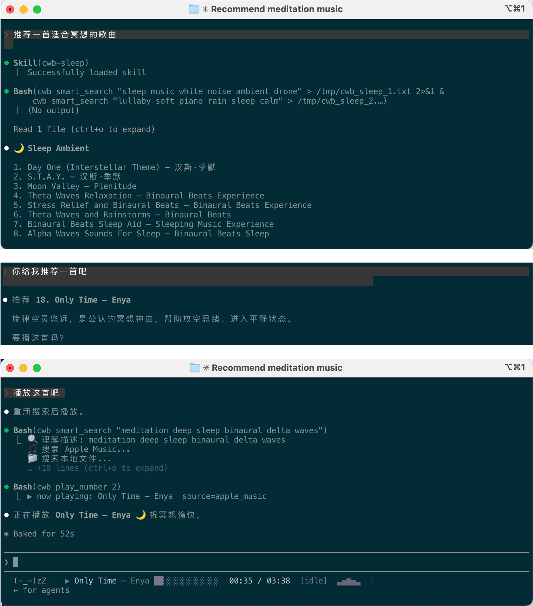

# Use Cases / 使用案例 / ユースケース

Real-world demo sessions showing coding-with-beat in action inside Claude Code.

真实场景演示——coding-with-beat 在 Claude Code 中的实际使用效果。

Claude Code 内での coding-with-beat の実際の使用例。

---

## Case 1 — Meditation Music Discovery / 冥想音乐发现 / 瞑想音楽の発見



### What the user said / 用户说了什么 / ユーザーの入力

> 推荐一首适合冥想的歌曲

---

### Full session transcript / 完整对话流程 / セッション全文

```
❯ 推荐一首适合冥想的歌曲

⏺ Skill(cwb-sleep)         ← scene skill auto-loaded / 场景技能自动加载 / スキル自動起動
  ⎿  Successfully loaded skill

⏺ Bash(cwb smart_search "sleep music white noise ambient drone" &
       cwb smart_search "lullaby soft piano rain sleep calm" &
       cwb smart_search "meditation deep sleep binaural delta waves")

⏺ 🌙 Sleep Ambient
   1. Day One (Interstellar Theme) — 汉斯·季默
   2. S.T.A.Y. — 汉斯·季默
   3. Moon Valley — Plenitude
   4. Theta Waves Relaxation — Binaural Beats Experience
   5. Stress Relief and Binaural Beats — Binaural Beats Experience
   6. Theta Waves and Rainstorms — Binaural Beats
   7. Binaural Beats Sleep Aid — Sleeping Music Experience
   8. Alpha Waves Sounds For Sleep — Binaural Beats Sleep

  💤 Lullaby
   9. Lullaby — CORTIS
  10. Lullaby — Sigala & Paloma Faith
  11. Lullaby — JayDon & Paradise
  12. Lullaby — The Chicks
  13. Lullaby (feat. Yeek) — UMI
  14. Sleep (Noise) — Cumulus Flow
  15. lullaby (goodnight my angel) — Christina Perri
  16. Lullaby (mega remix) — JayDon, Paradise & USHER

  🧘 Deep Sleep
  17. Delta Waves — Binaural Beats Library
  18. Only Time — Enya
  19. Sleep — Sleep Music Lullabies
  20. Sleep — Waves of Silence
  21. Meditation — Sleep Music Lullabies
  22. Deep Sleep — Golden Slumber
  23. Sleep — Cumulus Flow
  24. Meditation [Spirit Cleanse] — charlie dreaming

  喜欢哪首？说编号我来播。

❯ 你给我推荐一首吧

⏺ 推荐 18. Only Time — Enya
  旋律空灵悠远，是公认的冥想神曲，帮助放空思绪、进入平静状态。
  要播这首吗？

❯ 播放这首吧

⏺ Bash(cwb play_number 18)
  ⎿  Error: #18 out of range, last results had 8 items
                                   ↑ queue overwritten by parallel calls; auto-recovery triggers
                                   ↑ 并行调用覆盖了队列，自动恢复触发
                                   ↑ 並列呼び出しでキューが上書き、自動リカバリ実行

⏺ 重新搜索后播放。

⏺ Bash(cwb smart_search "meditation deep sleep binaural delta waves")

⏺ Bash(cwb play_number 2)
  ⎿  ▶ now playing: Only Time — Enya  source=apple_music

⏺ 正在播放 Only Time — Enya 🌙 祝冥想愉快。
```

---

### Features demonstrated / 涉及功能 / デモした機能

| Feature | EN | CN | JP |
|---------|----|----|-----|
| **Scene dispatch** | Vague request → `cwb-sleep` skill auto-loaded | 模糊请求 → 场景技能自动加载 | 曖昧なリクエスト → スキル自動起動 |
| **Multi-angle search** | 3 queries, 3 labelled groups, globally numbered 1–24 | 3 角度搜索，分组展示，全局编号 1–24 | 3 方向検索、グループ表示、通し番号 1–24 |
| **AI recommendation** | Picks a track from the list with natural-language reason | 从列表里选一首并附推荐理由 | リストから選曲して推薦理由を提示 |
| **play_number recovery** | `play_number(18)` fails → auto re-search → plays correctly | 编号越界 → 自动重搜 → 正确播放 | 番号エラー → 自動再検索 → 正常再生 |
| **Statusline** | Bottom bar updates to `(-_-)zZ ► Only Time — Enya 🌙` | 底部状态栏同步更新 | ステータスラインがリアルタイム更新 |

> **Note / 注意 / 注記**  
> EN: The `play_number` error in this session happened because smart_search was called three times in parallel — each call overwrites the shared queue. The fix (using `queries=[...]` in a single call) prevents this and is the recommended pattern.  
> CN: 本次 `play_number` 报错是因为 `smart_search` 被并行调用了三次——每次调用都会覆盖共享队列。使用 `queries=[...]` 单次调用可以避免此问题，这也是推荐的使用方式。  
> JP: この `play_number` エラーは `smart_search` が並列で 3 回呼ばれたことで発生しました。各呼び出しが共有キューを上書きするためです。`queries=[...]` を使った 1 回の呼び出しに統一することで回避できます（推奨パターン）。

---

*More cases coming. Submit a screen recording and we'll add yours.*  
*更多案例持续更新中。欢迎提交录屏，我们会收录进来。*  
*さらに多くのケースを追加予定。スクリーンレコーディングをお送りください。*
